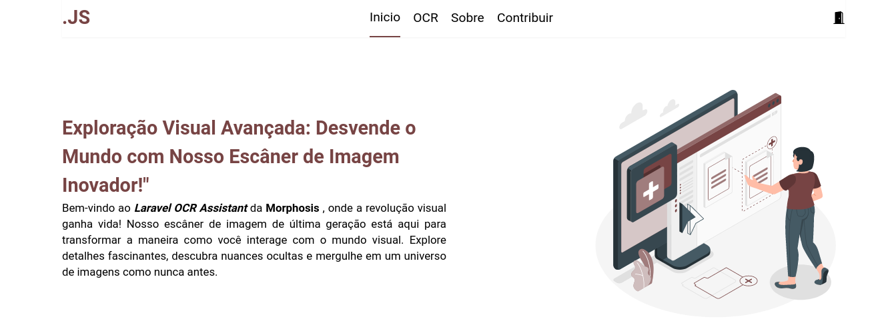
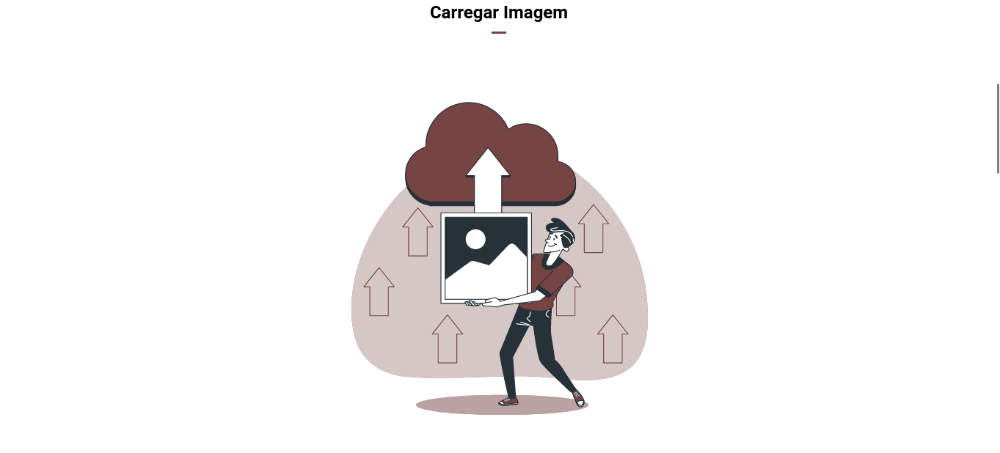
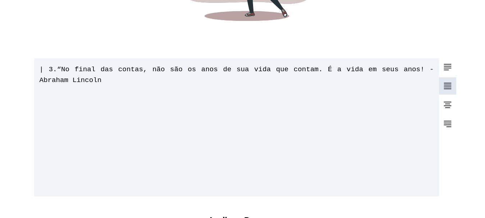
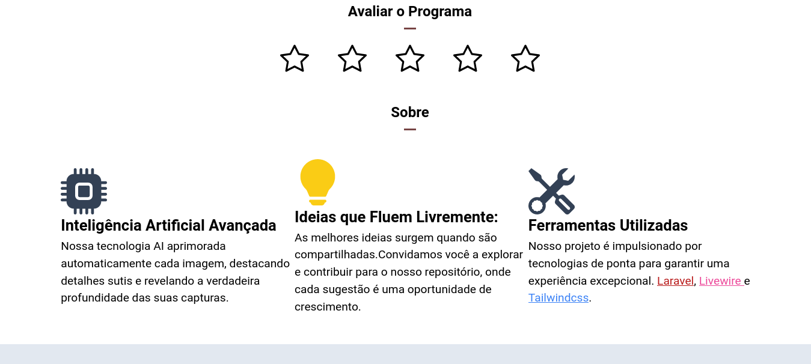
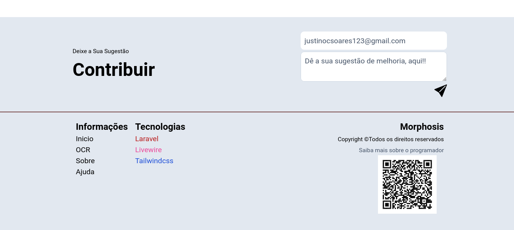

# Laravel OCR Assistant

## Descrição
Este projeto é uma aplicação Laravel que oferece uma solução eficiente para transformar imagens contendo texto em texto copiável. É uma ferramenta valiosa para otimizar fluxos de trabalho que envolvem a extração de informações de imagens, economizando tempo e aumentando a precisão.

## Funcionalidades Principais
- Converte imagens com texto em texto editável.
- Suporta vários formatos de imagem, incluindo JPEG, PNG e GIF.
- Oferece opções de formatação de saída para atender a diferentes necessidades.

## Exemplos de Uso
### Exemplo 1: Na Sessão De Carregar Imagem, Basta Apenas Arrastar a Imagem até a Ilustração
### Exemplo 2: Ou tricar na Ilustração de carregar imagem e poderás selecionar a Imagem

## Contato
- Email: justinocsoares123@gmail.com
- Instagram: justinoc_soares
- Facebook: Justino Soares
- Starstap: Morphosis

## Imagens

- Esse é um exemplo de uma capitura que retirou-se o texto

